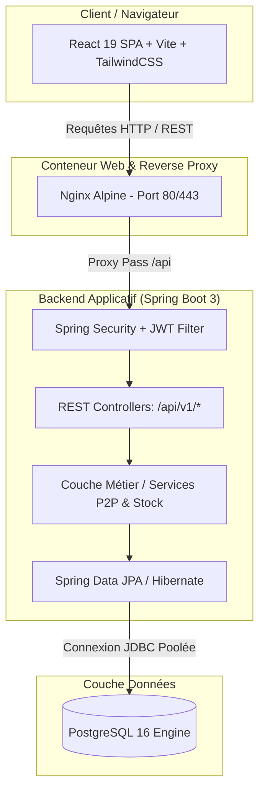
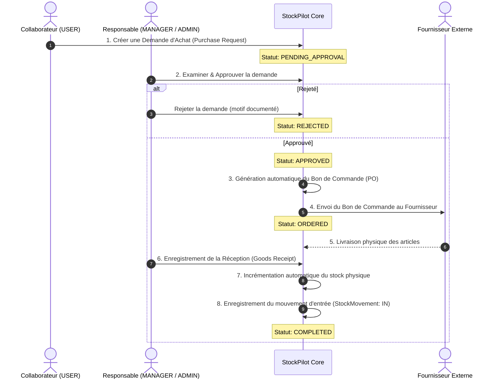

# 📦 StockPilot — Enterprise Stock & Procure-to-Pay Platform

<div align="center">


**Plateforme modulaire et sécurisée de gestion de stocks, d'entrepôts et du cycle d'achat d'entreprise (Procure-to-Pay — P2P).**

[Fonctionnalités Clés](#-fonctionnalités-clés) • [Architecture Système](#-architecture-système) • [Processus Métier (P2P)](#-processus-métier--flux-procure-to-pay-p2p) • [Sécurité & RBAC](#-sécurité--authentification-rbac) • [CI/CD & Déploiement](#-pipeline-cicd-github-actions) • [Démarrage Rapide](#-guide-de-démarrage-rapide)

</div>

---

## 🎯 1. Description du Projet

**StockPilot** est une solution logicielle d'entreprise (*Enterprise-grade*) conçue pour automatiser et optimiser la chaîne d'approvisionnement et le suivi logistique des stocks. Elle centralise les articles, les mouvements de stock, les relations fournisseurs, ainsi que l'ensemble du cycle de commande d'achat avec traçabilité complète et audit.

### 🌟 Fonctionnalités Clés

* **📦 Gestion du Catalogue & des Stocks** :
  * Référentiel des produits (SKU, code-barres, catégories, prix unitaire, devise).
  * Seuils d'alerte configurables (stock minimum, alerte de réapprovisionnement automatique).
  * Traçabilité de chaque mouvement de stock : Entrées (`IN`), Sorties (`OUT`), Ajustements d'inventaire (`ADJUSTMENT`).
* **🔄 Cycle d'Achat Complet (Procure-to-Pay / P2P)** :
  * Demandes d'achat internes initiées par les collaborateurs.
  * Circuit d'approbation hiérarchique par les Managers et Administrateurs.
  * Émission des bons de commande (*Purchase Orders*) vers les fournisseurs.
  * Réception contrôlée des marchandises avec mise à jour instantanée du stock physique.
* **👥 Sécurité & Contrôle d'Accès basé sur les Rôles (RBAC)** :
  * 3 profils utilisateurs stricts : `ADMIN`, `MANAGER`, `USER`.
  * Authentification stateless JWT avec mécanisme de rotation de Refresh Tokens.
  * Traçabilité des actions sensibles et protection CSRF / CORS fine.
* **📊 Dashboard & Métriques en Temps Réel** :
  * Vue synthétique de la valeur du stock, des alertes de rupture imminente et des commandes en cours.
* **🛡️ Qualité Logicielle & Couverture de Tests** :
  * Suite automatisée de **139 tests** (110 tests unitaires Mockito + 29 tests d'intégration Spring Security & MockMvc).

---

## 🏗️ 2. Architecture Système

Le projet est structuré sous la forme d'un **Monorepo propre et modulaire**, découplé entre le backend métier et l'interface utilisateur.



### 🧱 Composants Techniques

| Composant | Technologie | Description |
| :--- | :--- | :--- |
| **Backend** | Spring Boot 3.4.3 / Java 17 | API REST stateless, Spring Security 6, Hibernate JPA, Bean Validation, Lombok. |
| **Frontend** | React 19 / TypeScript / Vite | Single Page Application (SPA) réactive, TailwindCSS, Lucide Icons, Axios avec intercepteur de rafraîchissement de token. |
| **Base de Données** | PostgreSQL 16 Alpine | RDBMS transactionnel avec indexation des SKU, contraintes d'intégrité et clés étrangères. |
| **Conteneurisation** | Docker & Docker Compose | Multi-stage builds durcis, utilisateur non-root (`stockpilot:1001`), quotas de mémoire et de CPU. |
| **CI/CD** | GitHub Actions | 3 workflows indépendants : Validation CI bloquante, CD Staging et CD Production avec sas d'approbation manuelle. |

---

## 💼 3. Processus Métier : Flux Procure-to-Pay (P2P)

Le flux opérationnel de commande et de réapprovisionnement suit un cycle strict et sécurisé :



---

## 🔐 4. Sécurité & Authentification (RBAC)

### Modèle de Rôles

* **`ROLE_USER`** : Consultation des articles en stock, consultation des mouvements, création et suivi de ses propres demandes d'achat.
* **`ROLE_MANAGER`** : Création et modification d'articles, gestion des fournisseurs, approbation ou rejet des demandes d'achat, validation des réceptions de marchandises et réapprovisionnements.
* **`ROLE_ADMIN`** : Droits absolus, administration des utilisateurs et des rôles, paramétrage des seuils système, ajustements exceptionnels d'inventaire, consultation des métriques d'audit.

### Architecture des Jetons JWT

```
+-----------------------------------------------------------------------+
|  ACCESS TOKEN (Court terme - 60 min)                                  |
|  - Transmis dans l'en-tête: Authorization: Bearer <token>             |
|  - Contient: sub (username), roles (ADMIN/MANAGER/USER), exp, iat     |
+-----------------------------------------------------------------------+
                                  | (Expiré)
                                  v
+-----------------------------------------------------------------------+
|  REFRESH TOKEN (Long terme - 7 jours)                                 |
|  - Utilisé sur l'endpoint: POST /api/v1/auth/refresh                  |
|  - Permet de renouveler l'Access Token de manière transparente        |
+-----------------------------------------------------------------------+
```

---

## 🚀 5. Pipeline CI/CD (GitHub Actions)

L'intégration et le déploiement continu appliquent les **meilleures pratiques de niveau Entreprise** :

```
.github/workflows/
├── ci.yml                 # Validation continue : 139 tests automatisés, typecheck & build Vite, lint Docker
├── cd-staging.yml         # CD Staging : Publication images (staging-sha) -> Déploiement SSH Recette
└── cd-production.yml      # CD Production : Images durcies (vX.Y.Z, prod-sha) -> SAS D'APPROBATION -> Déploiement Prod
```

### 🛡️ Principes de Fiabilité Intégrés

1. **Politique Zéro `:latest`** : Tous les conteneurs sont tagués de manière **immuable** avec des versions explicites (`v1.0.0`, `staging-a1b2c3d`, `prod-a1b2c3d`). Cela garantit une traçabilité totale et permet un **rollback instantané en 1 clic**.
2. **Sas d'Approbation Manuelle en Production** : L'environnement GitHub `production` exige la validation formelle d'un Tech Lead ou Administrateur avant tout accès au serveur distant.
3. **Double Registre** : Support natif et simultané de **Docker Hub** et de **GitHub Container Registry (GHCR)**.
4. **Smoke Tests & Healthchecks** : Boucle de réessai automatique (`curl` avec retries) après déploiement pour certifier que l'application répond `200 OK`.

---

## 💻 6. Guide de Démarrage Rapide

### Prérequis

* **Docker & Docker Compose** (version 24+) *— Recommandé pour démarrer l'ensemble de la pile.*
* **Java 17+** et **Node.js 20+** *(si exécution en local sans Docker).*

### A. Lancement en 1 commande avec Docker Compose (Recommandé)

```bash
# 1. Cloner le projet
git clone https://github.com/said101112/StockPilot.git
cd StockPilot

# 2. Préparer l'environnement local
cp .env.example .env

# 3. Lancer les conteneurs (Base de données, Backend et Frontend)
docker compose -f docker-compose.yml -f docker-compose.dev.yml up -d --build
```

L'application est immédiatement accessible :
* 🌐 **Frontend React** : [http://localhost:5173](http://localhost:5173)
* ☕ **API Backend Spring Boot** : [http://localhost:8999/api/v1](http://localhost:8999/api/v1)
* 🗄️ **Base de Données PostgreSQL** : `localhost:5432` *(db: `stockpilot_db`, user: `postgres`)*

---

### B. Comptes de Démonstration (Pré-alimentés)

Au premier lancement en mode développement, la base est automatiquement initialisée avec 3 profils de test :

| Rôle | Nom d'utilisateur | Mot de passe |
| :--- | :--- | :--- |
| **Administrateur** | `admin` | `admin123` |
| **Responsable Achats** | `manager` | `manager123` |
| **Utilisateur Standard** | `user` | `user123` |

---

### C. Exécution des Tests Automatisés

```bash
# Exécuter les 139 tests (110 unitaires + 29 d'intégration)
cd backend
./mvnw clean test

# Vérification des types et bundle frontend
cd ../frontend
npm ci
npm run build
```

---

## 📂 7. Arborescence du Monorepo

```
StockPilot/
├── .github/
│   └── workflows/
│       ├── ci.yml                 # Pipeline CI (Tests, Quality Gates, Lint Compose)
│       ├── cd-staging.yml         # Pipeline CD Recette vers serveur Staging
│       └── cd-production.yml      # Pipeline CD Production avec sas d'approbation
├── backend/
│   ├── src/main/java/             # Code source Spring Boot 3 (Controllers, Services, Models)
│   ├── src/test/java/             # 139 tests automatisés (Unitaires Mockito + Intégration H2)
│   ├── Dockerfile                 # Dockerfile de développement
│   ├── Dockerfile.prod            # Dockerfile durci multi-stage (Alpine JRE, user non-root)
│   └── pom.xml                    # Dépendances Maven (Spring Security, JPA, JWT, Postgres)
├── frontend/
│   ├── src/                       # Application React 19 (Composants, Pages, Hooks, API)
│   ├── Dockerfile                 # Dockerfile frontend dev
│   ├── Dockerfile.prod            # Dockerfile durci multi-stage (Vite build + Nginx Alpine)
│   ├── package.json               # Dépendances NPM & scripts
│   └── vite.config.ts             # Configuration Vite & proxy
├── docker-compose.yml             # Configuration commune (services, réseaux, volumes)
├── docker-compose.dev.yml         # Surcharges pour le développement local
├── docker-compose.prod.yml        # Surcharges de production (ports isolés, quotas ressources)
├── .env.example                   # Modèle documenté des variables d'environnement
├── .gitignore                     # Règles d'exclusion Git (fichiers sensibles et temporaires)
└── README.md                      # Documentation principale du projet
```

---

## 📄 Licence & Contribution

Projet développé avec passion selon les standards de l'artisanat logiciel (*Software Craftsmanship*).  
Pour toute question ou contribution, veuillez ouvrir une issue ou soumettre une Pull Request sur la branche **`dev`**.
