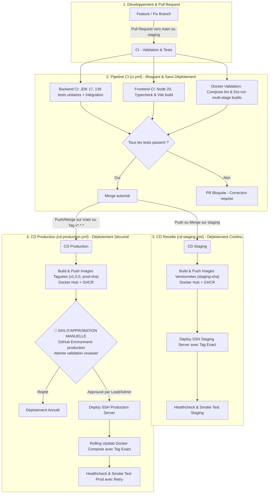

# 🚀 StockPilot — Architecture & Guide CI/CD (GitHub Actions)

Ce guide détaille l'architecture complète d'intégration continue (**CI**) et de déploiement continu (**CD**) de **StockPilot**. Conçu selon les meilleures pratiques d'ingénierie logicielle pour les monorepos full-stack (**Spring Boot 3 + React/Vite + PostgreSQL + Docker**), il garantit un cycle de livraison automatisé, sécurisé et zéro-régression.

---

## 🏷️ Règle d'Or : Versioning Immuable (Politique Zéro `:latest`)

> [!IMPORTANT]
> Dans ce pipeline, **le tag `:latest` est strictement banni en production et en recette**.
> - **Pourquoi interdire `:latest` ?** Le tag `:latest` est mutable : il change à chaque build, empêche de savoir quel commit exact tourne sur le serveur, et rend tout rollback incertain et périlleux.
> - **Ce qui est utilisé à la place :** Des **tags de version immuables** :
>   - **Production (Git Tag ou Release)** : `v1.0.0` et `1.0.0` (SemVer officiel).
>   - **Production (Push sur `main`)** : `prod-<short_sha>` et `sha-<short_sha>` (ex: `prod-a1b2c3d`).
>   - **Staging (Push sur `staging`)** : `staging-<short_sha>` (ex: `staging-a1b2c3d`).
>   - **Traçabilité totale** : Chaque conteneur déployé est lié à 100% à un commit Git précis.

---

## 🏗️ 1. Vue d'ensemble du Pipeline



---

## 📂 2. Organisation et Rôle des Fichiers de Workflow

Les workflows sont hébergés dans `.github/workflows/` et respectent le principe de responsabilité unique :

| Fichier Workflow | Événement Déclencheur | Registres Cibles | Politique de Tagging |
| :--- | :--- | :--- | :--- |
| [`.github/workflows/ci.yml`](file:///c:/Users/hp/Desktop/Hacker/StockPilot/.github/workflows/ci.yml) | • PR vers `main` ou `staging`<br>• Pushes sur `feat/**`, `fix/**` | *Aucun (Validation pure)* | Aucun push. Validation des 139 tests et de la syntaxe Docker. |
| [`.github/workflows/cd-staging.yml`](file:///c:/Users/hp/Desktop/Hacker/StockPilot/.github/workflows/cd-staging.yml) | • Push ou merge sur `staging`<br>• `workflow_dispatch` | **Docker Hub** + **GHCR** | `staging-<short_sha>` *(ex: staging-a1b2c3d)* |
| [`.github/workflows/cd-production.yml`](file:///c:/Users/hp/Desktop/Hacker/StockPilot/.github/workflows/cd-production.yml) | • Push sur `main`<br>• Tag Git `v*.*.*`<br>• `workflow_dispatch` | **Docker Hub** + **GHCR** | • `vX.Y.Z` & `X.Y.Z`<br>• `prod-<short_sha>`<br>• `sha-<short_sha>` |

---

## 🐳 3. Configuration Docker Hub & Registres

Le pipeline supporte à la fois **Docker Hub** (`docker.io`) et le registre privé **GitHub Packages** (`ghcr.io`).

### A. Générer un jeton Docker Hub (Personal Access Token)
1. Connectez-vous sur [hub.docker.com](https://hub.docker.com).
2. Rendez-vous dans **Account Settings** ➔ **Security** ➔ **New Access Token**.
3. Donnez une description (ex: `StockPilot CI/CD`) avec les droits **Read & Write**.
4. Copiez la clé secrète générée (`dckr_pat_...`).

### B. Déclarer les Secrets dans GitHub
Dans votre dépôt GitHub, allez dans **Settings** ➔ **Secrets and variables** ➔ **Actions** (ou dans chaque Environment) :
- `DOCKERHUB_USERNAME` : Votre identifiant Docker Hub (ou organisation).
- `DOCKERHUB_TOKEN` : Votre jeton d'accès Docker Hub (PAT).

> [!TIP]
> Si `DOCKERHUB_USERNAME` et `DOCKERHUB_TOKEN` sont configurés, le workflow pousse automatiquement les conteneurs sur votre compte Docker Hub sous les noms :
> - `<DOCKERHUB_USERNAME>/stockpilot-backend:<TAG>`
> - `<DOCKERHUB_USERNAME>/stockpilot-frontend:<TAG>`
> En parallèle, les images sont également sauvegardées de manière sécurisée sur `ghcr.io` !

---

## 🔍 4. Détail des Étapes de Chaque Workflow

### A. Pipeline d'Intégration Continue (`ci.yml`)

1. **Job `backend-ci` (Spring Boot & PostgreSQL)**
   - Setup JDK 17 (Temurin) avec cache Maven (`~/.m2`).
   - Exécution des **139 tests automatisés** : 110 tests unitaires métier + 29 tests d'intégration avec Spring Security et base H2.
   - Archivage des rapports Surefire en artefacts.
2. **Job `frontend-ci` (React & Vite)**
   - Setup Node.js 20 avec cache `npm`.
   - Installation déterministe `npm ci`.
   - Typecheck TypeScript strict et compilation de production `npm run build`.
   - Archivage du bundle `dist/`.
3. **Job `docker-validation`**
   - Lint de `docker-compose.yml`, `docker-compose.dev.yml` et `docker-compose.prod.yml`.
   - Dry-run build multi-stage Docker avec cache `type=gha`.

---

### B. Pipeline de Déploiement Staging (`cd-staging.yml`)

1. **Calcul du tag immuable** : Définition de `staging-${SHORT_SHA}`.
2. **Authentification** : Connexion à Docker Hub et GHCR.
3. **Build & Push** des images backend et frontend avec le tag `staging-${SHORT_SHA}`.
4. **Déploiement SSH (Serveur de Recette)** :
   - Export des variables `DOCKER_IMAGE_BACKEND` et `DOCKER_IMAGE_FRONTEND` avec le tag `staging-${SHORT_SHA}`.
   - Pull ciblé des conteneurs correspondants.
   - `docker compose up -d` pour un rechargement sans interruption.
   - **Smoke Test automatisé** via `curl` sur l'endpoint de santé.

---

### C. Pipeline de Déploiement Production (`cd-production.yml`)

1. **Verrouillage de concurrence** : `cancel-in-progress: false` (interdiction stricte de couper un déploiement prod).
2. **Calcul de la version sémantique** :
   - Si déclenché par un tag Git `v1.2.0` ➔ tags `v1.2.0`, `1.2.0`, `sha-<sha>`.
   - Si déclenché par push sur `main` ➔ tags `prod-<sha>`, `sha-<sha>`.
   - **Aucun tag `:latest` n'est généré**.
3. **🛑 Sas d'Approbation Manuelle (`environment: production`)** :
   - Le workflow s'arrête automatiquement.
   - Les relecteurs autorisés examinent le numéro de version et valident le déploiement.
4. **Déploiement SSH (Serveur de Production)** :
   - Authentification et `docker pull` de la version exacte approuvée.
   - Lancement avec Docker Compose.
   - **Boucle de healthcheck résiliente** (6 tentatives toutes les 10s).

---

## 🛑 5. Configuration du Sas d'Approbation Manuelle

```
GitHub Repository ➔ Settings ➔ Environments ➔ "production"
```

1. Dans votre dépôt GitHub, cliquez sur **Settings** ➔ **Environments**.
2. Cliquez sur **New environment** et nommez-le : `production`.
3. Sous **Environment protection rules** :
   - Cochez **Required reviewers**.
   - Ajoutez les personnes autorisées à valider la mise en production.
4. Cliquez sur **Save protection rules**.

---

## 🔐 6. Récapitulatif des Secrets GitHub

| Secret / Variable | Portée | Utilité |
| :--- | :--- | :--- |
| `DOCKERHUB_USERNAME` | Repository / Environment | Identifiant Docker Hub |
| `DOCKERHUB_TOKEN` | Repository / Environment | Access Token (PAT) Docker Hub |
| `STAGING_SSH_HOST` | Env `staging` | IP/Domaine serveur staging |
| `STAGING_SSH_USER` | Env `staging` | Utilisateur SSH staging |
| `STAGING_SSH_KEY` | Env `staging` | Clé privée SSH staging |
| `STAGING_APP_DIR` | Env `staging` | Dossier cible (ex: `/opt/stockpilot-staging`) |
| `PROD_SSH_HOST` | Env `production` | IP/Domaine serveur production |
| `PROD_SSH_USER` | Env `production` | Utilisateur SSH production |
| `PROD_SSH_KEY` | Env `production` | Clé privée SSH production |
| `PROD_APP_DIR` | Env `production` | Dossier cible (ex: `/opt/stockpilot`) |
| `PROD_HEALTH_URL` | Variable Env `production` | URL publique de santé (ex: `https://stockpilot.app/health`) |

---

## 🔄 7. Procédure de Rollback Instantané

Si une régression survient en production, le retour arrière est immédiat et déterministe grâce au versioning immuable :

1. Rendez-vous dans l'onglet **Actions** de votre dépôt GitHub.
2. Cliquez sur le workflow **CD - Production Deployment**.
3. Cliquez sur **Run workflow** :
   - Dans le champ `release_version`, saisissez le tag de l'ancienne version stable (ex: `v1.0.0` ou `prod-3f8a12c`).
4. Validez l'approbation manuelle : le pipeline va automatiquement télécharger et réactiver l'ancienne version exacte en moins de 30 secondes sans rien recompiler !
