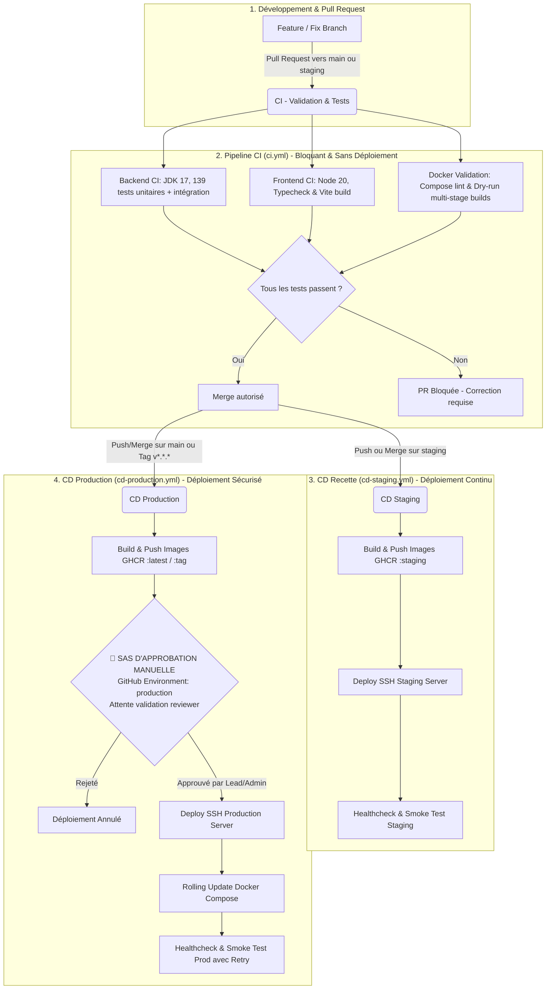

# 🚀 StockPilot — Architecture & Guide CI/CD (GitHub Actions)

Ce guide détaille l'architecture complète d'intégration continue (**CI**) et de déploiement continu (**CD**) de **StockPilot**. Conçu selon les meilleures pratiques d'ingénierie logicielle pour les monorepos full-stack (**Spring Boot 3 + React/Vite + PostgreSQL + Docker**), il garantit un cycle de livraison automatisé, sécurisé et zéro-régression.

---

## 🏗️ 1. Vue d'ensemble du Pipeline

Le cycle de vie du code suit un flux strict à travers 3 workflows indépendants :



---

## 📂 2. Organisation et Rôle des Fichiers de Workflow

Les workflows sont hébergés dans `.github/workflows/` et respectent le principe de responsabilité unique :

| Fichier Workflow | Événement Déclencheur | Objectif Principal |
| :--- | :--- | :--- |
| [`.github/workflows/ci.yml`](file:///c:/Users/hp/Desktop/Hacker/StockPilot/.github/workflows/ci.yml) | • Pull Requests vers `main` ou `staging`<br>• Pushes sur `feat/**`, `fix/**` | **Validation de qualité** : Exécution des tests, compilation frontend/backend, vérification Docker. Aucun conteneur n'est poussé, aucun serveur n'est touché. |
| [`.github/workflows/cd-staging.yml`](file:///c:/Users/hp/Desktop/Hacker/StockPilot/.github/workflows/cd-staging.yml) | • Push ou merge sur `staging`<br>• `workflow_dispatch` (déclenchement manuel) | **Livraison continue Staging** : Packaging automatique des images conteneurisées (`ghcr.io/...:staging`), déploiement SSH immédiat sur le serveur de recette. |
| [`.github/workflows/cd-production.yml`](file:///c:/Users/hp/Desktop/Hacker/StockPilot/.github/workflows/cd-production.yml) | • Push ou merge sur `main`<br>• Publication d'un tag de version `v*.*.*`<br>• `workflow_dispatch` | **Déploiement Production avec Approbation** : Création d'images durcies, arrêt sur sas de révision manuelle, déploiement SSH haute disponibilité avec boucle de healthcheck. |

---

## 🔍 3. Détail des Étapes de Chaque Workflow

### A. Pipeline d'Intégration Continue (`ci.yml`)

Ce workflow s'exécute en parallèle sur 3 jobs distincts dès qu'un développeur pousse sur sa branche ou ouvre une PR :

1. **Job 1 : `backend-ci` (Spring Boot & Base de Données)**
   - **Checkout du dépôt** (`actions/checkout@v4`).
   - **Configuration du JDK 17 Eclipse Temurin** avec mise en cache automatique des dépendances Maven (`~/.m2`).
   - **Exécution des 139 tests automatisés** :
     - 110 tests unitaires isolés (Mockito, services métier, règles de stock, validation).
     - 29 tests d'intégration complets avec Spring Security, base H2 en mémoire, et contrôleurs MockMvc.
   - **Archivage des rapports Surefire** : Les rapports XML/HTML sont enregistrés comme artefacts GitHub Actions pour faciliter le diagnostic en cas d'échec.

2. **Job 2 : `frontend-ci` (React, TypeScript & Vite)**
   - **Checkout du dépôt** (`actions/checkout@v4`).
   - **Configuration de Node.js 20** avec cache des paquets `npm`.
   - **Installation déterministe** : `npm ci` pour garantir la conformité avec `package-lock.json`.
   - **Validation TypeScript & Build** : `npm run build` (qui exécute `tsc -b && vite build`) vérifiant à la fois la conformité des types et la génération optimale du bundle JavaScript de production.
   - **Archivage du bundle `dist/`** en artefact de build.

3. **Job 3 : `docker-validation` (Intégrité des Conteneurs)**
   - **Initialisation de Docker Buildx** avec cache GitHub Actions (`type=gha`).
   - **Validation de syntaxe Docker Compose** : Teste `docker compose config` pour l'environnement de développement et de production.
   - **Dry-run Build** : Construit à blanc les images de production du backend et du frontend pour vérifier que les Dockerfiles multi-stage compilent sans erreur.

---

### B. Pipeline de Déploiement Staging (`cd-staging.yml`)

Ce workflow prend le relais dès que du code est fusionné dans la branche `staging` :

1. **Job 1 : `build-and-push-staging`**
   - Calcul des tags Docker : `:staging` et `:staging-<short_sha>`.
   - Authentification automatique au registre privé **GitHub Container Registry (GHCR)** via `GITHUB_TOKEN`.
   - Construction et publication des images Docker `backend` et `frontend` avec mise en cache GitHub Actions des couches de build (`mode=max`).
2. **Job 2 : `deploy-staging` (Cible environnement GitHub : `staging`)**
   - Connexion SSH sécurisée au serveur de staging via `appleboy/ssh-action`.
   - Récupération des dernières images depuis `ghcr.io`.
   - Démarrage des conteneurs via `docker compose -f docker-compose.yml -f docker-compose.prod.yml up -d`.
   - Nettoyage des images orphelines (`docker image prune -f`).
   - **Smoke Test automatisé** : Exécution d'un `curl` sur l'endpoint de healthcheck pour confirmer que le service est opérationnel.

---

### C. Pipeline de Déploiement Production (`cd-production.yml`)

Ce workflow applique les règles les plus strictes pour garantir la sécurité et la stabilité du service client :

1. **Règle de Concurrence (`concurrency`)** :
   - `cancel-in-progress: false` : Un déploiement de production en cours n'est **jamais annulé** par un nouveau commit, évitant ainsi de laisser les conteneurs dans un état instable ou partiel.

2. **Job 1 : `build-and-push-production`**
   - Résolution du tag de version (ex: `v1.0.0`, `prod-a1b2c3d`, `:latest`).
   - Compilation et publication des images de production durcies sur GHCR.

3. **Job 2 : `deploy-production` — 🛑 Sas d'Approbation Manuelle Obligatoire**
   - **Déclaration de l'environnement** : `environment: name: production`.
   - **Sas de validation** : Le pipeline **s'arrête automatiquement** avant d'exécuter la moindre action sur le serveur.
   - Seuls les relecteurs autorisés (Tech Lead, DevOps, Administrateur) peuvent inspecter la version et cliquer sur **"Approve and deploy"**.
   - Une fois approuvé, le déploiement SSH s'exécute :
     - Authentification sécurisée et pull des images `:latest` / taguées.
     - Mise à jour en continu (`rolling update`) via Docker Compose.
   - **Healthcheck résilient avec Retry** :
     - Le pipeline teste l'endpoint `PROD_HEALTH_URL` jusqu'à **6 fois avec un délai de 10 secondes** (pour laisser le temps à Spring Boot et PostgreSQL de finaliser leurs migrations).
     - Si l'endpoint ne renvoie pas `200 OK`, le job échoue immédiatement pour alerter l'équipe.

---

## 🛑 4. Comment Configurer l'Approbation Manuelle en Production

Pour que GitHub Actions exige une validation manuelle avant le déploiement sur votre serveur de production, suivez ces étapes simples dans GitHub :

```
GitHub Repository ➔ Settings ➔ Environments ➔ "production"
```

1. Dans votre dépôt GitHub, cliquez sur **Settings** (Paramètres).
2. Dans le menu de gauche, sous la section **Code and automation**, cliquez sur **Environments**.
3. Cliquez sur **New environment** et nommez-le exactement : `production`.
4. Dans la section **Environment protection rules** :
   - Cochez la case **Required reviewers** (Relecteurs requis).
   - Ajoutez votre compte GitHub ou l'équipe autorisée (ex: Tech Lead, DevOps).
   - *(Optionnel)* Cochez **Prevent self-review** si vous souhaitez qu'une autre personne que l'auteur du commit valide la mise en production.
   - *(Optionnel)* Définissez un **Wait timer** (délai de grâce avant démarrage).
5. Cliquez sur **Save protection rules**.

### Ce qui se passe lors d'une mise en production :
1. Le job `build-and-push-production` construit et publie les images.
2. Le job `deploy-production` passe en état **🟡 Waiting for review**.
3. Les reviewers reçoivent une notification par e-mail / notification GitHub avec un bouton :
   - **"Review deployments"** ➔ Affichage du commit et de l'environnement.
   - **"Approve and deploy"** ➔ Lance immédiatement le déploiement SSH sur le serveur.
   - **"Reject"** ➔ Annule le déploiement en toute sécurité sans impacter le serveur existant.

---

## 🔐 5. Configuration des Secrets GitHub

Dans **Settings** > **Environments**, configurez les secrets associés à chaque environnement :

### A. Environnement `staging`
| Secret / Variable | Type | Description |
| :--- | :--- | :--- |
| `STAGING_SSH_HOST` | Secret | Adresse IP ou FQDN du serveur de staging |
| `STAGING_SSH_USER` | Secret | Nom de l'utilisateur SSH (`ubuntu`, `deploy`, etc.) |
| `STAGING_SSH_KEY` | Secret | Clé privée SSH (format OpenSSH sans passphrase) |
| `STAGING_SSH_PORT` | Secret | *(Optionnel)* Port SSH personnalisé (défaut : `22`) |
| `STAGING_APP_DIR` | Secret | Répertoire hôte sur le serveur (ex: `/opt/stockpilot-staging`) |
| `STAGING_HEALTH_URL`| Variable | URL du healthcheck (ex: `https://staging.stockpilot.app/health`) |

### B. Environnement `production`
| Secret / Variable | Type | Description |
| :--- | :--- | :--- |
| `PROD_SSH_HOST` | Secret | Adresse IP ou FQDN du serveur de production |
| `PROD_SSH_USER` | Secret | Nom de l'utilisateur SSH de déploiement |
| `PROD_SSH_KEY` | Secret | Clé privée SSH autorisée sur le serveur de prod |
| `PROD_SSH_PORT` | Secret | *(Optionnel)* Port SSH personnalisé (défaut : `22`) |
| `PROD_APP_DIR` | Secret | Répertoire hôte sur le serveur (ex: `/opt/stockpilot`) |
| `PROD_HEALTH_URL` | Variable | URL publique pour le test de santé (ex: `https://stockpilot.app/health`) |

> [!NOTE]
> L'authentification au registre de conteneurs **GitHub Container Registry (`ghcr.io`)** est entièrement native et automatique via `${{ secrets.GITHUB_TOKEN }}` fourni par GitHub Actions, sans aucune saisie manuelle de mot de passe !

---

## 🖥️ 6. Préparation Initiale du Serveur Distant

Sur votre machine distante (serveur VPS / Cloud Ubuntu ou Debian), exécutez ces étapes une seule fois :

```bash
# 1. Créer le dossier applicatif
sudo mkdir -p /opt/stockpilot && cd /opt/stockpilot

# 2. Copier les fichiers compose du projet
# (docker-compose.yml, docker-compose.prod.yml et .env.prod.example)

# 3. Créer le fichier .env de production sécurisé
cp .env.prod.example .env
chmod 600 .env
nano .env  # Renseignez vos identifiants réels (DB_PASSWORD, JWT_SECRET, etc.)

# 4. Autoriser l'utilisateur de déploiement à exécuter Docker sans sudo
sudo usermod -aG docker $USER
```

---

## 🛡️ 7. Stratégie de Branches & Bonnes Pratiques

- **`feat/nom-feature`** ou **`fix/nom-bug`** :
  - Développez toujours vos modifications sur une branche dédiée créée depuis `main`.
  - Ouvrez une Pull Request. Le workflow **CI** s'assure automatiquement que la compilation et les **139 tests** sont au vert.
- **`staging`** :
  - Branche dédiée à la recette / validation métier.
  - Tout merge déclenche le workflow **CD Staging** pour tester l'application en conditions réelles.
- **`main`** :
  - Branche de référence de production.
  - Tout merge ou création de tag (`v1.0.0`) déclenche le workflow **CD Production** qui nécessite l'**approbation d'un relecteur** avant tout déploiement physique.
