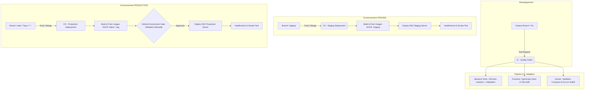

# 🚀 StockPilot — Architecture & Guide CI/CD (GitHub Actions)

Ce guide détaille l'architecture d'intégration et de déploiement continu (CI/CD) de **StockPilot**, conçue selon les meilleures pratiques d'entreprise pour les monorepos full-stack (Spring Boot + React/Vite + PostgreSQL + Docker).

---

## 🏗️ 1. Vue d'ensemble du Pipeline



---

## 📂 2. Organisation des Fichiers de Workflow

Les fichiers sont strictement séparés et modulaires dans `.github/workflows/` :

| Fichier | Déclencheur | Rôle |
| :--- | :--- | :--- |
| **`ci.yml`** | PR vers `main`/`staging`, pushes `feat/**`, `fix/**` | Exécute les 139 tests backend (H2 en mémoire), le typecheck frontend (`npm run build`), et la validation Docker Compose sans rien déployer. |
| **`cd-staging.yml`** | Push sur branche `staging` ou dispatch manuel | Construit les images Docker, les pousse sur **GHCR** (`:staging`), et déploie automatiquement sur le serveur de recette. |
| **`cd-production.yml`** | Push sur branche `main`, tags `v*.*.*`, ou dispatch manuel | Construit les images de production durcies (`:latest`, `:vX.Y.Z`), soumet au sas d'approbation manuelle GitHub, et déploie en production. |

---

## 🔐 3. Configuration des Secrets & Variables GitHub

Rendez-vous dans votre dépôt GitHub : **Settings** > **Environments**.

### A. Environnement `staging`
Créez un environnement nommé `staging` et ajoutez les secrets suivants :
- `STAGING_SSH_HOST` : Adresse IP ou nom de domaine de votre serveur de staging.
- `STAGING_SSH_USER` : Utilisateur SSH (ex: `ubuntu`, `deploy`, `debian`).
- `STAGING_SSH_KEY` : Clé privée SSH (OpenSSH format).
- `STAGING_APP_DIR` : Répertoire cible sur le serveur (ex: `/opt/stockpilot-staging`).
- *(Optionnel)* Variable `STAGING_HEALTH_URL` : URL publique du healthcheck (ex: `https://staging.stockpilot.app/health`).

### B. Environnement `production`
Créez un environnement nommé `production` :
1. **Protection Rules (Optionnel mais recommandé)** : Activez **Required reviewers** et désignez les personnes devant approuver chaque mise en production.
2. Ajoutez les secrets suivants :
   - `PROD_SSH_HOST` : Adresse IP ou domaine du serveur de production.
   - `PROD_SSH_USER` : Utilisateur SSH (ex: `deploy`, `ubuntu`).
   - `PROD_SSH_KEY` : Clé privée SSH.
   - `PROD_APP_DIR` : Répertoire cible (ex: `/opt/stockpilot`).
   - *(Optionnel)* Variable `PROD_HEALTH_URL` : URL publique du healthcheck de prod (ex: `https://stockpilot.app/health`).

> [!NOTE]
> L'authentification au registre de conteneurs **GitHub Packages (GHCR)** est entièrement native et automatique grâce au jeton `${{ secrets.GITHUB_TOKEN }}` fourni par GitHub sans aucune configuration manuelle !

---

## 🐳 4. Déploiement sur le Serveur

Sur votre serveur distant (Staging ou Production), préparez le dossier d'hébergement :

```bash
# 1. Cloner ou déposer les fichiers de configuration Docker
mkdir -p /opt/stockpilot && cd /opt/stockpilot

# 2. Copier docker-compose.yml, docker-compose.prod.yml et .env
cp .env.example .env
nano .env  # Renseignez vos mots de passe et secrets de production !

# 3. Le workflow GitHub Actions s'occupera d'exécuter :
docker compose -f docker-compose.yml -f docker-compose.prod.yml up -d --remove-orphans
```

---

## 🛡️ 5. Stratégie de Branches Recommandée

- **`feat/nom-fonctionnalite`** : Développez vos fonctionnalités sur des branches isolées. En ouvrant une Pull Request vers `staging` ou `main`, le workflow **CI** vérifie automatiquement que votre code compile et que tous les 139 tests passent.
- **`staging`** : Branche d'intégration. Tout merge déclenche immédiatement la compilation et le déploiement sur l'environnement de test / préproduction.
- **`main`** : Branche de production officielle. Tout merge déclenche le pipeline de production avec vérification et validation.
